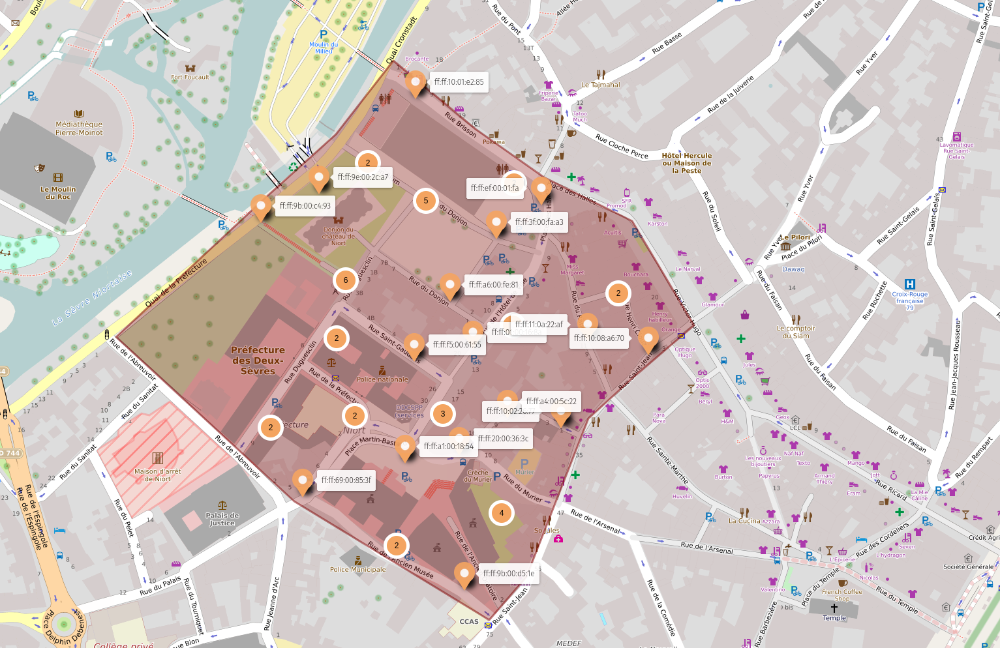

# RiskBox

En fouillant le salon du INNN, nos équipes d'intervention ont saisie 3 RiskBox.

Ces équipements semblent controler les propagateurs de vulnérabilité du Dr RiSK. Elles indiquent un décompte sur un petit écran.

Vous devez trouver un moyen pour les désactiver pour stopper la menace. Le temps est compté !

Un document de l'équipe terrain de l'agence a été laissé à votre intention ainsi qu'un coffre sécurisé.
Vous devez vous munir d'un téléphone avec les fonctions Bluetooth et NFC ainsi que d'un ordinateur portable. 

## Résolution

Objets à disposition : une lampe sans pile, une boîte fermée à code, un QR code, 
deux série de symboles (genre de tirets).

Les flags pré-finale donnaient les 3 premiers chiffres de la boïte à code. On teste les 10 chiffres pour
le dernier. Les piles de la lampe sont dans la boîte.

Le QR Code renvoie vers une carte umap : 
<https://umap.openstreetmap.fr/fr/map/r1sk_pr0p4g4t0r_790737#17/46.32310/-0.46397>

Le lampe torche a des leds UV. En éclairant les segments bizarres, ils sont complétés pour former les textes : 
`GAMEPARTNERS` et `IPSOON`.

Ce sont deux stands sur le salon. Nous récupérons dans un des stands un QR Code endommagé, et un dispositif électonique
enregistreur dans lequel un texte (pas très clair) est enregistré.

Il semblerait qu'il existe des softs de reconstruction.... mais on n'en a pas trouvé. 

Un nettoyage permet de : rajouter du blanc autour des marqueres de position dans les coins et du marqueur d'alignement central.
Pour les autres... on peut dans certain cas reconstituer le carré blanc entier lorsqu'on en voit qu'une partie.

On obtient ceci : 

Si on le scanne avec un tél (testé avec SecScanQR), ça fonctionne grâce à la redondance présente dans le QR code.
Le résultat est au format  MeCard (<https://en.wikipedia.org/wiki/QR_code#Joining_a_Wi%E2%80%91Fi_network>)

Une fois nettoyé, il indique : 
`WIFI:S:384e68cbddd9951078d88935723e87e1;T:WPA;P:iNnN_2022_@1;;`
Il y a bien un réseau Wifi avec le SSID `384e68cbddd9951078d88935723e87e1` et le pass indiqué.

A posteriori, <https://merricx.github.io/qrazybox/> fait une partie du job. Il faut faire pas mal de retouche, mais on retrouve 
bien les infos : 

L'écoute du [message audio](audio.wav) donne une série de mots utilisant [l'alphabet phonétique de l'OTAN](https://fr.wikipedia.org/wiki/Alphabet_phon%C3%A9tique_de_l%27OTAN).
On reconnaît (pas facilement) tous les mots, sauf DOT. On laisse un point : `THFLS.KMRR`

Et là... on n'a pas reconnu un [mapcode](https://en.wikipedia.org/wiki/Mapcode).
On peut le décoder ici  <https://www.mapcode.com/>

Cette localisation permettait de retrouver un tag NFC+Bluetooth,
et dont l'adresse physique (BT) est celle qu'on peut voir sur la première carte, à cette
localisation : `ff:ff:10:06:ac:46`

La lecture du tag NFC (avec NFC Tools ou NXP TagInfo/Android, par exemple) donne le pass : `StOp_Ze_B0x_One` 

