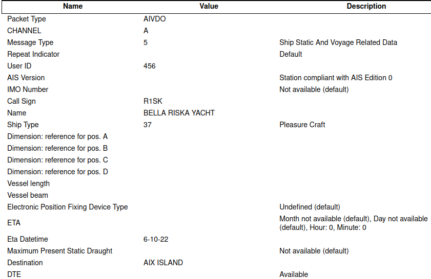

# Le Pompon II

Nous serions aussi intéressés de récupérer le nom de son moyen de transport.

Le Flag est sous format `INNN{NOM DU MOYEN DE TRANSPORT}`.

Fichier fourni : [tracker2.txt](tracker2.txt)

## Solution

Cette fois-ci le fichier est très court :
```
!AIVDO,2,1,0,A,50001j000001;5<d0008Dhh618U<d61T4<Q@000U00000000000BF82Dk0CQ0,0*4C
!AIVDO,2,2,0,A,0000000000,2*16
```

On essaie de chercher la chaîne `!AIVD` présente à chaque ligne. Et bingo, c'est un format connu de l'[AIS](https://fr.wikipedia.org/wiki/Syst%C3%A8me_d%27identification_automatique), et Google nous propose tout de suite des décodeurs. On utilise le premier proposé, et :



Le flag est donc `INNN{BELLA RISKA YACHT}`.

Pour plus de détails techniques : [AIVDM/AIVDO protocol decoding](https://gpsd.io/AIVDM.html)