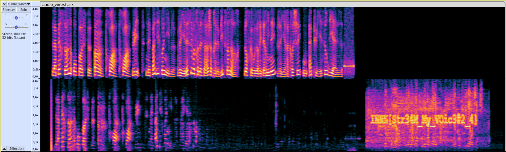

# Ne Quittez pas !

On pense avoir une exfiltration de données venant de nos locaux.

Heureusement, notre système d'interception de nouvelle génération a capturé des informations !

Analysez rapidement les trames pour en avoir le coeur net.

Ce défi est recommandé pour l'épreuve finale

[Fichier fourni](capture.pcapng)

## Résolution

La capture est celle d'une conversation VoIP.
Les données sonores sont encodées et tronçonnées dans des paquets UDP.

### 1ère tentative  

Récupérer les données dans les paquets UDP, les décoder (les normes sont G.711 ou G.729
<https://www.softwareadvice.com/resources/what-is-sip/>

Le code python fourni est censé faire ça sur un des deux flux et 
enregistre un `.wav`. On distingue quelque chose, mais c'est pas clair.
Je ne sais pas ce qui ne va pas.
(Cela dit, en faisant l'analyse spectro comme indiqué plus bas sur le 
fichier dégueu, on voit quand même le flag :) )

### 2e tentative

Wireshark à la rescousse.... il sait analyser les flux VoIP !

Charger la capture pcap, puis Téléphonie / SIP Flux / Lire les flux
(pas mal de moyens d'arriver à la représentation visuelle des 2 flux audio).
On a le flux dans chaque sens avec l'écho d'un des flux dans l'autre.

Le flux qui nous intéresse est celui qui se termine le plus tard. On entend :
*Docteur je n'ai rien trouvé d'intéressant, je continue mes recherches*.

Il y a du bruit. L'information est dans le bruit.

Sauvegarder le flux audio vers un fichier audio `audio_wireshark.wav`.
Puis utiliser une vue en fréquence. Par exemple dans audacity, 
on a une vue spectrogramme. Le Flag est dessiné dessus...

Flag : `INNN{Str34M_My_VOic3#2_4}`
Attention : Impossible de vérifier le flag maintenant... je sais plus si c'est VOice ou V0ice...

