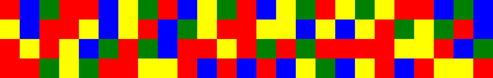

#  Nouvelle Génération

Nos services d'enquêtes ont collecté cette image dans un laboratoire de recherche clandestin.

## Résolution

On a 4 couleurs différentes, et une inspection rapide des pixels ne montre rien de
spécial excepté des artefacts de compression jpg.

C'est peut être de la base 4 ?

Des 4 couleurs  RJBV, on ne sait pas qui vaut 0, 1, 2, ou 3. 
On teste donc toutes les combinaisons. Ainsi qu'une lecture ligne par ligne
ou colonne par colonne. 
Chaque groupe de 4 couleurs correspond à un octet. 

Flag : `INNN{R1sK_3nGrave_In_DN4}`

