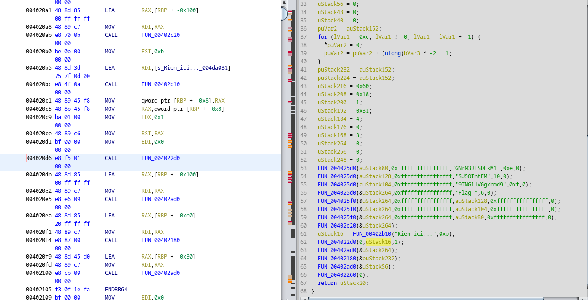

# Le Pied Marin

Par chance, nous avons réussi à trouver une information sur un container 
dans un système appartenant au Dr Risk.

Votre expertise pourra surement nous aider à trouver des élements intéressants !
`registry.eu-west-0.prod-cloud-ocb.orange-business.com/risk-corp/nothing_app:latest`

## Résolution

On récupère le container docker : 

```
> docker pull registry.eu-west-0.prod-cloud-ocb.orange-business.com/risk-corp/nothing_app:latest
> docker images

REPOSITORY                                                                    TAG       IMAGE ID       CREATED         SIZE
registry.eu-west-0.prod-cloud-ocb.orange-business.com/risk-corp/nothing_app   latest    2899bf5af390   7 weeks ago     2.38MB
...

> docker run 2899bf5af390

Rien ici...

> docker run -ti 2899bf5af390 sh 
# Inspection des fichiers... rien excepté le programme exécutable : myprog

> docker ps
CONTAINER ID   IMAGE          COMMAND   CREATED          STATUS          PORTS     NAMES
25d940901f57   2899bf5af390   "sh"      44 seconds ago   Up 43 seconds             youthful_kilby

> docker cp 25d940901f57:/mycode  mycode
```

On a maintenant le fichier [mycode](mycode) sur la machine hôte.

J'ai essayé de l'analyse avec `strace`  `ltrace`... mais je n'arrive à rien.

Avec ghidra, on retrouve la fonction qui affiche rien ici :



Les 3 chaînes `SU...`, `9T...` ont manifestement un raport avec le flag.

On peut tenter de les concaténer dans un sens ou dans l'autre : 

```python
>>> a = "SU5OTntEM"
>>> b = "9TMG1lVGgxbmd9"
>>> c = "GNrM3JfSDFkM1"
>>> a + b + c
'SU5OTntEM9TMG1lVGgxbmd9GNrM3JfSDFkM1'
>>> base64.b64decode(a + b + c)
b'INNN{D3\xd4\xcc\x1bYU\x1a\x0c[\x99\xdfF6\xb37%\xf4\x83\x16C5'
>>> base64.b64decode(a + c + b)
b'INNN{D0ck3r_H1d3_S0meTh1ng}'
```

Flag : `INNN{D0ck3r_H1d3_S0meTh1ng}`
