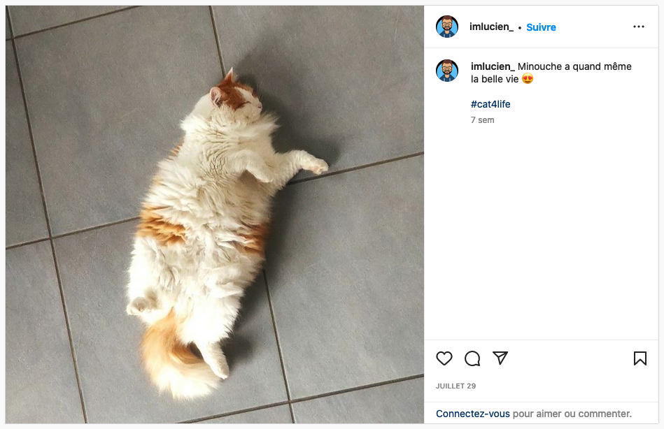
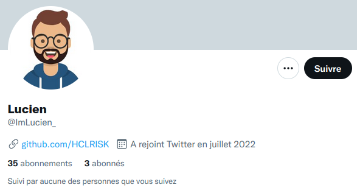
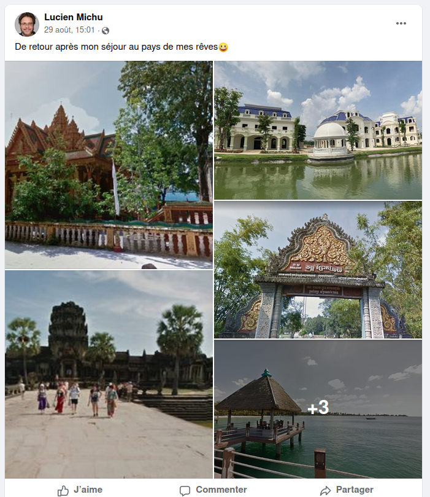
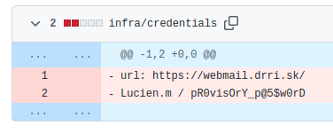
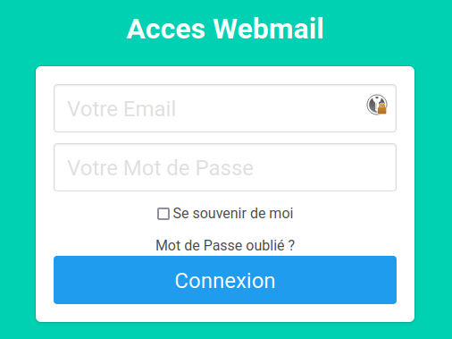
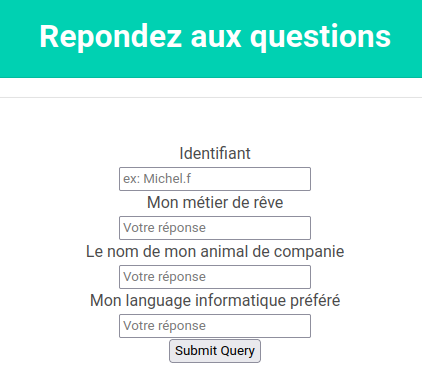
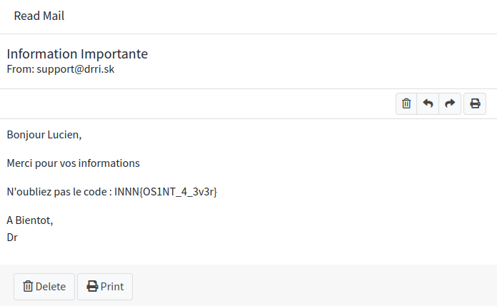

# Super Stalker

## Énoncé

Nous avons retrouvé la piste d'un des agents du Dr RiSK.

Son pseudo est `ImLucien_`.

Enquêtez sur cette personne pour avoir plus d'informations et se connecter à son compte mail.

## Solution

Un des moyens de faire des recherches en source ouvertes sur des réseaux sociaux, c'est d'utiliser
[Sherlock](https://github.com/sherlock-project/sherlock). Ce n'est pas le seul outil de ce type, 
mais c'est celui que l'on a utilisé ici.

Il est disponible sous forme d'image Docker pour plus de facilité :

```console
$ docker run theyahya/sherlock ImLucien_
[...]
[*] Checking username ImLucien_ on:

[+] Fiverr: https://www.fiverr.com/ImLucien_
[+] Instagram: https://www.instagram.com/ImLucien_
[+] Pokemon Showdown: https://pokemonshowdown.com/users/ImLucien_
[+] RuneScape: https://apps.runescape.com/runemetrics/app/overview/player/ImLucien_
[+] Star Citizen: https://robertsspaceindustries.com/citizens/ImLucien_
[+] Telegram: https://t.me/ImLucien_
[+] Twitter: https://twitter.com/ImLucien_
[+] Whonix Forum: https://forums.whonix.org/u/ImLucien_
[+] metacritic: https://www.metacritic.com/user/ImLucien_
[+] skyrock: https://ImLucien_.skyrock.com/

[!] End:  The processing has been finished.
```

Il ya des faux positifs, voilà ce qui va nous intéresser:
- sur [Instagram](https://www.instagram.com/imlucien_/), Lucien nous partage une photo de sa chatte Minouche:



- sur [Twitter](https://twitter.com/ImLucien_), sa bio contient une référence vers Github, on y reviendra par la suite.



Cela dit, Sherlock rate des trucs. Par des recherches complémentaires (notamment avec le
nom `Lucien Michu`), on récupère aussi:

- un compte [Facebook](https://www.facebook.com/profile.php?id=100085218362921), où il partage ses photos de vacances. 
On y trouve notamment des photos d'Angkor Vat, au Cambodge.



- un compte [LinkedIn](https://www.linkedin.com/in/lucien-michu-076614246/), où il se présente comme développeur indépendant à Niort.

Il est maintenant temps de creuser le compte [GitHub](https://github.com/HCLRISK). Celui ci contient notamment [un projet](https://github.com/HCLRISK/RISK_mail) 
qui semble faire référence au Dr. Risk. On ne trouve rien de spécial dans le code ou les issues, mais [l'historique](https://github.com/HCLRISK/RISK_mail/commit/6a2741125bf154197795f974a9f6ec9e1757dbec) montre un fichier qui a été supprimé :



On va sur https://webmail.drri.sk/ : 



On tente de se connecter mais le login n'est pas pris en compte (il demande un mail). On clique sur mot de passe oublié :



On nous demande les réponses à 3 questions secrètes. On n'a pas toutes les infos, mais si on rafraîchit la page, les questions changent. On répète l'opération jusqu'à avoir trois réponses qu'on a trouvées dans nos recherches :
- identifiant : Lucien.m
- destination de rêve : Cambodge (Facebook)
- animal de compagnie : Minouche (Instagram)
- métier de rêve : Développeur (LinkedIn)

Bingo ! On rentre dans la boite mail et le premier mail de la liste donne le flag :


