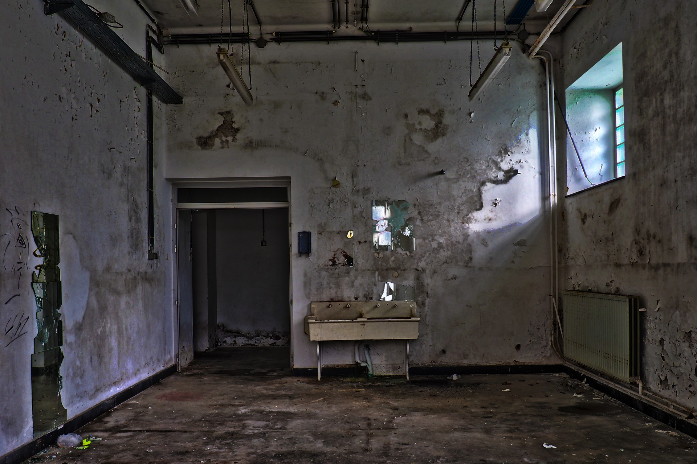

# Énoncé

Un agent du Dr.RiSK a été capturé et a été fouillé.

Il avait sur lui un téléphone comportant peu d'éléments, mais une photo venant d'un numéro inconnu a attiré notre attention.

Ce defi est recommandé pour l'epreuve finale



# Solution 

```
> exiftool dirt.jpg
ExifTool Version Number         : 12.42
File Name                       : dirt.jpg
Directory                       : .
File Size                       : 626 kB
File Modification Date/Time     : 2022:10:01 19:28:35+02:00
File Access Date/Time           : 2022:10:01 19:30:06+02:00
File Inode Change Date/Time     : 2022:10:01 19:29:29+02:00
File Permissions                : -rw-r--r--
...
Comment                         : JFHE4TT3JAYWIZBTNZPUYNDCOMRTGXZXPU======
Image Width                     : 1920
Image Height                    : 1279
```

```
echo JFHE4TT3JAYWIZBTNZPUYNDCOMRTGXZXPU====== | base32 -d
INNN{H1dd3n_L4bs#3_7}
```

Flag : `INNN{H1dd3n_L4bs#3_7}`


