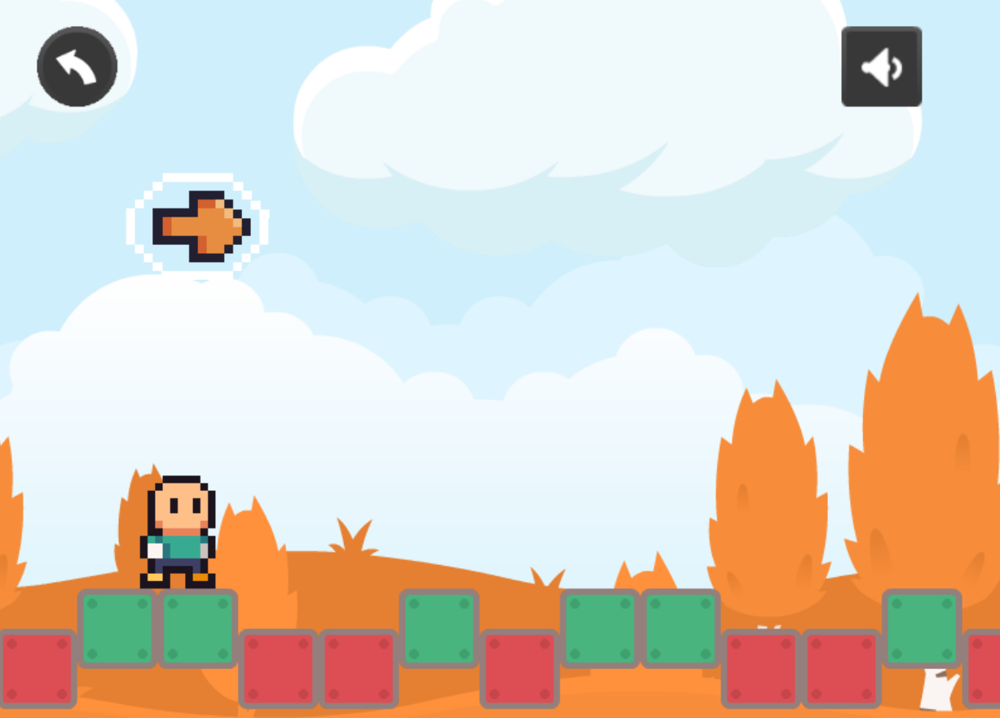

# PEGI 1+0

Notre cellulle d'investigation "E-Sports" a collecté le lien sur un étrange jeu en ligne sur un réseau suspect.
<http://game.drri.sk>

## Résolution

C'est laborieux. 
Il y a des cubes hauts et des cubes bas. 
Retranscrire les positions par des 0 pour les cubes bas et des 1 pour les cubes haut.

Puis on cherche que faire de cette séquence binaire : découpages de 7 ou 8 bits pour trouver des lettres ? 
Ça marche pas.

On remarque ainsi que les caractères 3,4 sont les mêmes que 5, 6 et 7,8 : `e\x96e©e©e©` comme dans `INNN`.
On essaie de faire 1 caractère avec 2 octets plutôt qu'avec 1 seul octet... 
par exemple en s'inspirant d'un code Manchester : Passage de 0 à 1 -> 1 et passage de 1 à 0 -> 0.
Ça tombe bien, il n'y a aucune paire 00 ou 11.
Par contre, on ne sait pas du front montant ou descendant qui vaut 0 ou 1, 
ça fait deux possibilité à essayer.

Flag : `INNN{Blu3_M0on}`
